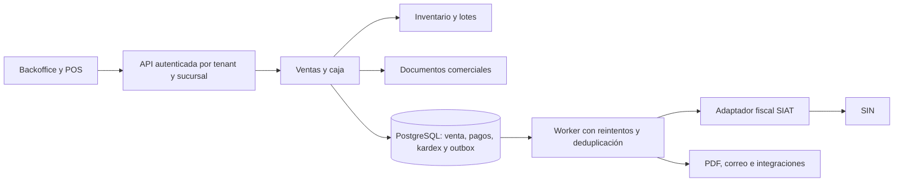

# Plan de implementación — PharmaCore Bolivia / FARMAXIA

**Fecha:** 12 de septiembre de 2026.  
**Destino:** implementación posterior con Antigravity.  
**Estado:** planificación para revisión; no se ha implementado el sistema.  
**Pedido incorporado, revisión 2:** el cajero decide en cada venta entre factura digital y recibo no fiscal; ambas modalidades descuentan inventario. La elección no requiere aprobación adicional del administrador. Proformas diferenciadas y demás decisiones pendientes explícitas.

## 1. Cómo utilizar este plan

Este documento sigue el orden SDD: EXPLORE → PROPOSE → SPEC + DESIGN → TASKS → APPLY → VERIFY → ARCHIVE. Contiene la exploración consolidada, la propuesta, las especificaciones iniciales, el diseño propuesto y el backlog. APPLY, VERIFY de la aplicación y ARCHIVE quedan para Antigravity.

Leer junto con:

- [CONTEXTO_CONSOLIDADO.md](CONTEXTO_CONSOLIDADO.md): contexto completo de los tres documentos iniciales.
- [PharmaCore_Bolivia_Master_Specification.md](PharmaCore_Bolivia_Master_Specification.md): arquitectura inicial, DBML y ejemplos.
- [Plan_SaaS_Farmacia_Bolivia.md](Plan_SaaS_Farmacia_Bolivia.md): alcance funcional y comercial original.
- [Prompt_Agente_Codigo_PharmaSaaS.md](Prompt_Agente_Codigo_PharmaSaaS.md): referencia histórica de entregables.
- [PROMPT_INICIO_ANTIGRAVITY.md](PROMPT_INICIO_ANTIGRAVITY.md): instrucciones de entrada al trabajo.

La solicitud actual añade la doble modalidad de venta y confirma que su elección corresponde al cajero. D01 está resuelta por el usuario. Los ejemplos antiguos no son código aprobado. Las elecciones marcadas como **propuesta** siguen pendientes de decisión y no se convierten en requisitos confirmados por aparecer aquí. El registro D01–D22 contiene una decisión confirmada y 21 pendientes; una decisión pendiente detiene solamente el trabajo que dependa de ella.

## 2. EXPLORE: punto de partida y hallazgos

El alcance contempla 13 módulos y tres planes comerciales. La carpeta contiene documentación, no una aplicación construida. El Master incluye 17 tablas y ejemplos de FEFO, SIAT y control de suscripción, pero faltan entidades para varios módulos, controles de integridad y pruebas.

Se deben resolver especialmente:

1. SIAT como add-on en Básico frente a su prohibición en el prompt original.
2. Usuarios/cajas simultáneos frente a recursos registrados.
3. Estados de suscripción inconsistentes entre texto, DBML y guard.
4. FEFO con asignaciones a varios lotes frente a un solo lote por línea de venta.
5. Permisos de usuarios para múltiples sucursales y relaciones seguras entre registros de un tenant.
6. Costo promedio contable frente a costo de salida calculado por lote.
7. POS sin conexión frente a contingencia exclusivamente del SIN.
8. Auditoría y funciones sanitarias distribuidas por plan sin delimitar mínimos aplicables.
9. Esquema de datos y roadmap incompletos frente a los 13 módulos.
10. Nueva separación entre venta, cobro, documento comercial y documento fiscal.

### 2.1. Decisión confirmada: el cajero elige el comprobante

El usuario confirma que el negocio operará con ventas facturadas y ventas con recibo, y que el cajero debe decidir el tipo de comprobante al confirmar cada venta. D01 deja de ser una condición pendiente de habilitación. El plan no incluye un guard tributario que seleccione la modalidad por el cajero ni una aprobación adicional del administrador para emitir el recibo.

Cada operación permanece registrada como venta real, con modalidad, cajero, sucursal, fecha, cobro, lotes y movimientos. La factura necesita la configuración técnica SIAT correspondiente. La emisión de recibos funciona independientemente de las credenciales SIAT y no crea solicitudes de facturación.

Esta definición establece el comportamiento del software; no determina por sí misma el tratamiento tributario del negocio. Se conserva como referencia informativa la [RND del SIN, artículo 25](https://www.impuestos.gob.bo/wp-content/uploads/2025/10/RND11.pdf#page=13).

Una vez confirmada una venta en modalidad factura, los fallos o resultados inciertos de SIAT se gestionan conservando esa elección y su historial. El sistema no la cambia automáticamente a recibo. D03 define la integración y sus [procedimientos de contingencia](https://siatinfo.impuestos.gob.bo/index.php/facturacion-en-linea/emision-y-envio-de-facturas/contingencia-y-eventos-significativos).

## 3. PROPOSE: resultado y entregas

Construir un SaaS donde cada farmacia o cadena sea un tenant aislado, con sucursales, almacenes, cajas y permisos propios. Las ventas deben afectar inventario y cobros de forma consistente, independientemente del documento elegido por el cajero.

### 3.1. Primera entrega operativa propuesta

El primer piloto debe incluir:

- Core SaaS, planes configurables, onboarding asistido y permisos.
- Catálogo, fraccionamiento, compras/recepciones, lotes, kardex y FEFO.
- POS, caja por turnos, pagos registrados y dos modalidades documentales elegidas por el cajero.
- Proforma sin movimiento físico y conversión a venta; reserva opcional explícita.
- Integración SIAT para una modalidad inicialmente seleccionada, con estados, conciliación y contingencias necesarias.
- Operación real multisucursal: stock por ubicación y traspasos con recepción.
- Devoluciones, mermas, arqueos, reportes unificados y auditoría.
- Controles sanitarios mínimos aplicables a los productos que se autorice vender.
- Backups restaurables, observabilidad y pruebas de aislamiento/concurrencia.

La prueba de multisucursal utilizará al menos **dos tenants, con dos sucursales por tenant**. El plan de prueba habilitará esas cuotas. Un piloto exclusivamente monosucursal no demuestra el requisito central del usuario.

### 3.2. Entregas posteriores, conservadas en el alcance

Comisiones y guardias avanzadas; fidelización y convenios empresariales; ABC y analítica avanzada; API pública, delivery y omnicanal; automatización de cobros del SaaS; segunda modalidad SIAT si corresponde; operación local offline avanzada; informes sanitarios adicionales. Las funciones sanitarias o fiscales indispensables para una operación habilitada deben estar presentes desde su lanzamiento, aunque su interfaz avanzada llegue después.

### 3.3. Límites de la primera entrega

Propuesta: precios en BOB, una venta atendida desde una sucursal/almacén de despacho, crédito empresarial avanzado posterior y conexión al backend requerida para confirmar ventas en el piloto inicial. La continuidad frente a indisponibilidad del SIN se incluye en SIAT. La operación cuando la sucursal pierde conexión con el propio SaaS necesita otro diseño; si resulta imprescindible desde el inicio, D10 incorpora ese trabajo antes del piloto.

No incluye desarrollo de una contabilidad general completa, hardware propio ni certificación regulatoria automática. No se inicia producción sin resolver sus condiciones de entrada.

## 4. SPEC: opciones del POS y efectos observables

### 4.1. Las dos opciones de venta solicitadas

| Operación | Stock físico | Pago/caja | Documento | Integración SIAT |
| --- | --- | --- | --- | --- |
| **Vender con factura digital** | Descuenta al confirmar la venta, una sola vez | Registra el cobro confirmado; el medio determina si afecta efectivo u otra cuenta | Factura fiscal y su representación gráfica, según estado y modalidad | Sí, o procedimiento fiscal de contingencia |
| **Vender con recibo no fiscal** | Descuenta al confirmar la venta, una sola vez | Registra el cobro con las mismas reglas | Recibo numerado identificado como documento no fiscal | No genera CUF/XML fiscal ni solicitud de emisión |
| **Guardar proforma** — acción auxiliar | No descuenta físicamente | No registra ingreso por venta ni cobro | Cotización/proforma con vigencia | No |
| **Reservar una proforma** — si se habilita | Conserva stock físico; disminuye disponibilidad para otros pedidos | Sin cobro en el alcance inicial | Proforma y reserva con vencimiento | No |

La venta con recibo se registra como venta real en reportes, caja, inventario y auditoría. La proforma es una cotización dentro de este sistema: no se usa como nombre alternativo para una venta terminada. Un anticipo sobre cotización sería un flujo distinto, pendiente de especificación fiscal y contable; no se incorpora silenciosamente.

### 4.2. Reglas funcionales numeradas

- **RF01 — Aislamiento:** toda lectura, mutación, descarga, exportación y tarea en segundo plano debe respetar tenant y permisos de sucursal.
- **RF02 — Suscripciones:** las cuotas/features se aplican en backend; controlar creación concurrente. La suscripción no modifica el tratamiento fiscal de una transacción.
- **RF03 — Cantidades:** validar producto, presentación, factor y cantidad positiva entera; guardar cantidad comercial y unidades base.
- **RF04 — FEFO:** consumir lotes elegibles por vencimiento, con desempate estable; bloquear vencidos, cuarentena y stock no disponible. Cambios autorizados entre lotes elegibles requieren motivo.
- **RF05 — Confirmación única:** cada intento lógico de venta tiene una clave idempotente; reintentos o doble clic no duplican stock, cobro ni venta.
- **RF06 — Modalidad fiscal:** cuando el cajero selecciona factura digital, emitir mediante la configuración SIAT del emisor y registrar sus resultados sin bloquear filas de inventario durante llamadas de red.
- **RF07 — Elección del cajero y recibo:** el cajero con permiso de venta elige factura digital o recibo no fiscal para cada operación, sin aprobación adicional ni guard tributario de selección. El recibo es numerado y auditable, descuenta inventario y registra cobros; nunca crea emisión SIAT.
- **RF08 — Proformas/reservas:** cotizar no vende. Una reserva reduce disponibilidad, caduca/libera y se consume al convertir; la conversión es idempotente.
- **RF09 — Caja y pagos:** separar efectivo, tarjeta, QR y crédito; no considerar QR pagado por mostrarlo o adjuntar imagen sin el procedimiento de verificación acordado.
- **RF10 — Correcciones:** distinguir anulación documental, anulación de operación, devolución de mercancía y reembolso; cada una tiene permisos y efectos propios.
- **RF11 — Compras/kardex:** recibir mercadería por lote, registrar costos y deuda cuando corresponda; cada cambio físico tiene movimiento rastreable.
- **RF12 — Traspasos:** solicitud → aprobación cuando aplique → despacho → tránsito → recepción; manejar diferencias sin crear o perder stock.
- **RF13 — Regencia:** los controles de receta/lote/paciente/prescriptor y restricciones sanitarias se aplican también a ventas con recibo.
- **RF14 — Reportes/auditoría:** mostrar todas las ventas y sus clasificaciones; registrar estados fiscales pendientes y evitar doble conteo documental.
- **RF15 — Continuidad:** distinguir caída del SIN, caída de internet de sucursal y caída del backend; reintentos y conciliación conservan los registros de origen.
- **RF16 — Evolución:** mantener trazabilidad de comisiones, CRM, convenios, analítica e integraciones hacia ventas y eventos originales sin volver a descontar inventario.

### 4.3. Selector de comprobante del cajero

Antes de confirmar la venta, mostrar dos opciones claras:

- **Con factura digital** → `document_mode = FISCAL_INVOICE`.
- **Sin factura — emitir recibo** → `document_mode = NON_FISCAL_RECEIPT`.

La elección es visible y explícita para cada venta; el cajero puede cambiarla mientras la operación sea borrador. El backend valida el valor seleccionado, el permiso normal de venta, la caja/sucursal, el stock y los pagos. No exige permiso especial de supervisor, fundamento de excepción ni aprobación por operación para el recibo.

Guardar la modalidad final, el usuario que la seleccionó y la fecha de confirmación. Incluir el campo en auditoría, listados, exportaciones y filtros de reportes. Los totales comerciales del mismo carrito no cambian automáticamente por elegir recibo en lugar de factura; cualquier regla de precios se trata en D08.

Si se selecciona factura y falta configuración técnica SIAT, informar el problema antes de confirmar sin cambiar la elección automáticamente. El cajero puede editar el borrador y seleccionar recibo. Una venta ya confirmada se modifica mediante los flujos de corrección de §5.7, conservando su historial y sin duplicar movimientos.

### 4.4. Flujo común de confirmación

1. Resolver usuario, tenant, sucursal, almacén, caja y turno abierto.
2. Validar suscripción, permisos, presentación-producto, cantidades, precios/descuentos calculados por backend, modalidad elegida por el cajero y requisitos de receta. Validar configuración SIAT únicamente cuando se eligió factura.
3. Resolver pago según medio y estado. En el piloto, el crédito solo se permite si su submódulo está definido; un pago pendiente no se muestra como confirmado.
4. En una transacción local: adquirir idempotencia y bloqueos, asignar lotes FEFO, crear venta/líneas/asignaciones, consumir reserva si existe, registrar movimientos y cobros locales, asignar número interno y guardar auditoría/eventos durables.
5. Confirmar la transacción y conservar la elección del cajero. Para venta fiscal, procesar emisión mediante el adaptador SIAT y reflejar el resultado real. Para recibo, crear el documento comercial sin encolar emisión fiscal.
6. Imprimir o descargar. Un fallo de impresora/PDF no repite la venta: se ofrece reimpresión del mismo registro.

Los cobros externos no se incluyen en una falsa transacción distribuida con PostgreSQL. Autorización/captura, callbacks y posibles compensaciones deben especificarse en D14; conservar identificador del proveedor y deduplicar notificaciones.

### 4.5. Ejemplo de stock que debe reproducir el sistema

Existencia inicial: **100 unidades**. El cajero elige factura para una venta de 12 unidades: quedan **88**. Luego elige recibo para una venta de 8: quedan **80**. Cotizar 5 unidades deja físico **80**; si se reservan, disponible **75**. Convertir esa reserva en venta deja físico **75**, reservado **0**, disponible **75**. Reimprimir documentos conserva esos saldos.

Si un recibo requiere una corrección fiscal jurídicamente procedente, vincular el documento resultante a la venta existente. No crear otra venta ni repetir descuento/cobro. No se ofrece «facturar cuando quiera» como procedimiento habitual para postergar una obligación. Si una factura se emitió erróneamente, el tratamiento se resuelve mediante el flujo permitido de corrección, con historial.

### 4.6. Documentos impresos

Recibo: encabezado **RECIBO DE VENTA — DOCUMENTO NO FISCAL**, identificación del emisor/sucursal, serie y número internos, fecha, cajero, cliente cuando corresponda, productos/presentaciones/cantidades/precios, descuentos, total, pagos y referencia de la venta. Sin CUF, CUFD ni apariencia de validación del SIN. No equivale a la categoría tributaria «factura sin derecho a crédito fiscal».

Proforma: encabezado **PROFORMA / COTIZACIÓN**, número propio, fecha y vigencia, precios/condiciones y estado de reserva si existe. No incluir leyendas de pago confirmado cuando no hubo cobro.

Factura: formato y campos fiscales obtenidos de la especificación oficial aplicable, impresión térmica 58/80 mm y PDF según formatos seleccionados. Las reimpresiones no cambian importes ni identificadores.

## 5. DESIGN: arquitectura propuesta

### 5.1. Stack de referencia para estimar y diseñar

**Propuesta pendiente D02:** backend NestJS + TypeScript; frontend Vue 3 + Quasar; PostgreSQL; Redis para colas/cache; almacenamiento privado compatible con S3 para documentos; Docker Compose para desarrollo y primer despliegue controlado.

Se recomienda como punto de partida por su correspondencia con los ejemplos y alternativas ya presentes en los MD y por permitir un lenguaje compartido entre frontend y backend. No es una elección confirmada del usuario. Si se elige FastAPI, Go o Laravel, conservar los contratos de negocio y ajustar estimaciones, estructura y librerías antes de crear el proyecto. Versiones y dependencias se fijan en D02 comprobando soporte y compatibilidad.

NestJS documenta su estructura modular y soporte TypeScript; Quasar se apoya en Vue para construir interfaces. Estas fuentes justifican capacidades, no una promesa de rendimiento. [Documentación NestJS](https://docs.nestjs.com/), [documentación Quasar](https://quasar.dev/introduction-to-quasar/).

### 5.2. Separación por módulos

Propuesta: **monolito modular** con un proceso worker para tareas, y un adaptador SIAT aislado por contrato. Mantener posibilidad de extraer SIAT como servicio cuando el lenguaje de firmas, la autorización o la operación lo justifiquen. Evitar comenzar con múltiples microservicios sin necesidad demostrada.

La venta con recibo usa el mismo núcleo de ventas/inventario. Solo la venta fiscal crea la solicitud de emisión correspondiente. Se publican eventos desde una outbox durable guardada en la misma transacción que la venta; el worker tolera entregas repetidas. Redis no sustituye la fuente de verdad de ventas ni movimientos.

### 5.3. Aislamiento y autorización

- Base compartida y tablas de negocio con `tenant_id`; planes/catálogos globales se distinguen expresamente de datos de cada cliente.
- Propuesta de defensa: contexto en aplicación y RLS en PostgreSQL, con claves compuestas o restricciones equivalentes para pertenencia de referencias.
- Usuario de ejecución separado del propietario de tablas, sin superusuario ni `BYPASSRLS`; comprobar aislamiento usando el mismo rol de producción. PostgreSQL documenta excepciones a RLS para esos roles. [PostgreSQL: Row Security Policies](https://www.postgresql.org/docs/current/ddl-rowsecurity.html).
- Contexto transaccional por petición/job; probar reutilización del pool sin fuga de tenant. No confiar en cabeceras ni UUID enviados por el cliente sin comprobar pertenencia.
- `user_branch_memberships` permite varias sucursales; validar por recurso y acción, no solo por una sucursal seleccionada en pantalla.
- Archivos, cache, búsquedas, webhooks y exportaciones también deben aislar tenants. Acceso de soporte central excepcional, acotado y auditado.

### 5.4. Modelo de datos que debe completar el DBML

Nombres orientativos; normalización, claves, índices, restricciones y migraciones definitivas se generan en D05 y tareas A02–A04.

| Dominio | Entidades necesarias |
| --- | --- |
| SaaS | `tenants`, `legal_entities` si D04 exige varios emisores, `plans`, `plan_features`, `plan_limits`, `subscriptions`, `subscription_events`, `usage_counters`, cobros/documentos del SaaS |
| Organización/acceso | `branches`, `warehouses`, `cash_registers`, `users`, `roles`, `permissions`, `user_roles`, `user_branch_memberships`, `sessions` |
| Fiscal por emisor | `tax_profiles`, mapeos de sucursal/punto de venta y credenciales SIAT referenciadas de forma segura; sin guard tributario para seleccionar el comprobante |
| Catálogo | `products`, `product_presentations`, laboratorios/principios activos según diseño, `product_barcodes`, `price_lists`, `sin_catalog_mappings` |
| Inventario | `batches`, `inventory_balances`, `inventory_movements`, `stock_reservations`, `inventory_counts`, ajustes/mermas |
| Compras | `suppliers`, `purchase_orders`, `purchase_order_items`, `goods_receipts`, líneas por lote, `supplier_invoices`, `payables`, `supplier_payments` |
| Ventas | `sales` con `document_mode`, usuario selector y fecha, `sale_items`, **`sale_item_allocations`**, `sale_payments`, `payment_attempts`, devoluciones y líneas/reembolsos |
| Proformas | `quotations`, `quotation_items`, relación con reserva y venta de conversión |
| Documentos comerciales | `commercial_documents`, `document_sequences`, relación con venta/cotización y referencias de corrección |
| Caja | `cash_shifts`, `cash_movements`, arqueos y diferencias por medio de pago |
| SIAT | `fiscal_documents`, estados/intentos, CUIS/CUFD, eventos significativos, paquetes, códigos/mapeos, anulaciones/correcciones |
| Traspasos | solicitudes, líneas, asignaciones por lote, despachos, existencias en tránsito, recepciones y diferencias |
| Regencia | recetas y metadatos, adjuntos privados, dispensaciones controladas, libro/movimientos y balances |
| Auditoría/integración | `audit_events`, `idempotency_records`, `outbox_events`, entregas/reintentos de webhooks |
| Evolución comercial | clientes, cuentas/convenios/crédito, puntos, reglas/liquidaciones de comisiones y guardias |

La línea comercial almacena presentación, cantidad, precio y factor utilizados como fotografía histórica. Las asignaciones registran cuánto se tomó de cada lote en unidades base. No reescribir ventas antiguas si cambia una presentación o un precio.

### 5.5. Invariantes de inventario, dinero y numeración

- Cantidades físicas en unidades base enteras; saldo nunca negativo. `disponible = físico vendible - reservado`; cuarentena y tránsito no son venta disponible en origen/destino.
- Orden estable de bloqueo por recurso; si falta stock, revertir toda la operación local. Considerar conflictos y reintentos acotados.
- Kardex como libro de movimientos auditable y saldos como proyección transaccional conciliable; ajustes con motivo, sin edición silenciosa de saldos.
- Valores monetarios con aritmética decimal exacta, escala y reglas de redondeo definidas. No calcular precios ni impuestos con floats binarios sin una política explícita.
- Salida física FEFO y valoración contable son conceptos separados; D08 decide costo promedio/por lote y devoluciones.
- Serie de recibos/proformas y numeración fiscal independientes. Restricciones únicas y asignación atómica bajo concurrencia; recibos anulados no se borran ni renumeran.
- Clave idempotente por tenant/operación con hash del contenido: mismo pedido devuelve resultado previo; misma clave con contenido diferente produce conflicto.
- Una venta puede tener documentos relacionados/históricos; no puede producir dos facturas fiscales activas para el mismo hecho sin un caso fiscal expresamente especificado.

### 5.6. Estados independientes

| Objeto | Estados orientativos | Regla |
| --- | --- | --- |
| Proforma | borrador, emitida, vencida, cancelada, convertida | Nunca equivale a venta confirmada; conversión única en piloto |
| Reserva | activa, consumida, liberada, vencida | Consume disponibilidad, no genera ingreso |
| Venta | borrador, confirmada, parcialmente devuelta, devuelta, anulada | Confirmación produce efectos locales una sola vez |
| Pago | pendiente, autorizado, confirmado, rechazado, reembolsado parcial/total | Distinguir registro local de confirmación externa |
| Documento fiscal | pendiente, enviando, aceptado, rechazado, resultado desconocido, contingencia pendiente, anulado | Estado fiscal no reemplaza al estado de venta o pago |
| Recibo comercial | emitido, anulado, relacionado con corrección | No asignar estados de aceptación del SIN |

Si el SIN no responde, el resultado puede ser desconocido aunque haya recibido la factura. Consultar estado antes de generar otra emisión. Un rechazo fiscal deja trabajo visible de resolución; no transforma la venta en no fiscal ni repone mercancía automáticamente. D03 debe concretar las transiciones usando los servicios y procedimientos de la modalidad elegida.

El cierre de una venta fiscal al cliente debe entregar el documento emitido mediante el flujo habilitado, en línea o por contingencia válida. Una venta local confirmada con emisión pendiente es un estado de trabajo que se debe resolver y supervisar; no autoriza a sustituir indefinidamente el documento requerido por un recibo.

### 5.7. Correcciones, devoluciones y cierres

Una devolución física crea movimiento inverso al lote/ubicación permitido, con inspección para determinar si retorna a disponible o cuarentena. El reembolso es una operación de pago asociada. El documento fiscal se ajusta mediante el mecanismo aplicable, sin confundirlo con la devolución.

Anular una factura por error de datos no devuelve físicamente productos. Reemitirla como corrección no repite el ingreso. Si la operación nunca se realizó, se coordina la reversión comercial, financiera y fiscal conservando cada resultado. Ninguna cancelación usa borrado físico de ventas confirmadas.

Reportes separados: ventas confirmadas netas de devoluciones; cobros/reembolsos por medio; documentos fiscales por estado; recibos no fiscales; proformas sin mezclarlas con ingresos. Un recibo vinculado a corrección fiscal no se suma como segunda venta.

## 6. Registro de decisiones y condición de avance

**Estado:** D01 confirmada por el usuario; D02–D22 pendientes según su alcance. La elección del comprobante por el cajero no requiere una nueva consulta ni aprobación.

**Responsables:** Producto = usuario; Técnico = responsable de implementación con Antigravity; Tributario = contador/asesor del negocio; Regencia = profesional responsable de farmacia. Ninguna validación de un asesor sustituye requisitos oficiales que correspondan.

| ID | Punto a resolver | Propuesta inicial / dato necesario | Responsable | Se necesita antes de |
| --- | --- | --- | --- | --- |
| D01 | Quién decide factura o recibo — **CONFIRMADA** | El cajero elige en cada venta. Ambas modalidades descuentan stock y registran cobro; sin aprobación adicional del administrador ni guard tributario de selección | Usuario / Producto | Resuelta; implementar RF07, V03/V05 y T09/T10 |
| D02 | Stack, versiones y ORM | NestJS/TypeScript + Vue/Quasar + PostgreSQL; elegir ORM con soporte probado de transacciones/RLS; fijar versiones soportadas | Producto + Técnico | Crear proyecto y migraciones |
| D03 | Modalidad SIAT y autorización | Computarizada o electrónica según emisor; definir software propio/proveedor o proveedor de facturación contratado, pruebas y requisitos vigentes | Tributario + Técnico | Diseñar adaptador fiscal definitivo y piloto fiscal |
| D04 | Tenant, razón social y NIT | Una empresa/NIT por tenant inicialmente; confirmar si una cadena agrupa varias razones sociales; sucursales y puntos de venta mapeados por emisor | Producto + Tributario | Modelo organizativo/fiscal |
| D05 | DBML completo y roles de base | Completar entidades, claves compuestas, multi-sucursal de usuarios, asignaciones por lote, RLS/ORM y pruebas de integridad | Técnico | Migraciones de dominio |
| D06 | Planes y add-ons | Mantener límites 1/3/ilimitadas sucursales; resolver SIAT add-on Básico; contingencias necesarias acompañan cualquier modalidad fiscal habilitada | Producto | Guard comercial y catálogo de planes |
| D07 | Qué se cuenta en las cuotas | Separar usuarios registrados, sesiones concurrentes, cajas registradas y activas; ilimitado mediante valor explícito, nunca número mágico | Producto + Técnico | Guard de usuarios/cajas y pruebas de concurrencia |
| D08 | Dinero, precios y costos | BOB inicial; precisión/redondeo, descuentos autorizados, CPP frente a lote, tratamiento de devoluciones y precio por presentación/sucursal | Producto + Tributario + Técnico | Compras y cálculos del POS |
| D09 | Proformas y reservas | Cotización sin stock físico; definir vigencia, reserva opcional/TTL y política al cambiar precio o vencer lote | Producto | Implementar reservas/conversión |
| D10 | Alcance offline | Piloto con backend accesible + contingencia SIN; decidir si es obligatorio vender sin acceso al SaaS y con varios terminales desconectados | Producto + Técnico | Cerrar alcance del piloto |
| D11 | Suscripción: estados y suspensión | Máquina única: trialing/active/past_due/suspended/canceled y reglas de gracia; conservar acceso a consultas y obligaciones pendientes según política | Producto + Técnico | Core de suscripciones |
| D12 | Auditoría y retención | Separar visibilidad comercial de conservación; definir plazos por clase y protección de históricos sanitarios/fiscales | Tributario + Regencia + Técnico | Política de archivos/retención y producción |
| D13 | Medicamentos controlados | Productos/categorías permitidos, recetas, campos, adjuntos, retención, formatos y reportes que exijan AGEMED/SEDES | Regencia | Habilitar esos productos en cualquier tipo de venta |
| D14 | Pagos y devoluciones | Efectivo/tarjeta/QR, registro manual o integración, pagos combinados, conciliación, anticipos y reembolsos | Producto + Tributario + Técnico | POS con pagos reales |
| D15 | Traspasos | Aprobación, recepción parcial, faltantes, daño, costos y autorización para resolver diferencias | Producto + Regencia | Traspasos operativos |
| D16 | Infraestructura y backups | Hosting, dominio, correo, almacenamiento, restauración, retención, RPO/RTO y presupuesto | Producto + Técnico | Entorno de piloto y producción |
| D17 | Hardware del POS | Impresora/modelo/ancho, navegador/SO, lector, cajón y prueba de impresión; pago externo sin datos de tarjeta sensibles | Producto + Técnico | Aceptación de POS en farmacia |
| D18 | Corrección recibo/factura | Casos permitidos, responsable, vínculo con venta, fechas y procedimiento oficial; no posponer sistemáticamente la emisión | Tributario + Técnico | Habilitar correcciones documentales reales |
| D19 | Identidad y diseño | Nombre PharmaCore/FARMAXIA, marca, sucursales, accesibilidad, pantallas y navegación de cajero/regente/administrador | Producto | UI final |
| D20 | Clientes/convenios y privacidad | Datos mínimos, acceso al historial, puntos, límites de crédito/cobro, finalidad de uso y archivo de recetas | Producto + Regencia + Técnico | CRM, archivos clínicos e integraciones externas |
| D21 | Carga y objetivos de servicio | Tenants/sucursales/cajas iniciales, ventas pico, volumen de productos/documentos; fijar métricas y umbrales verificables | Producto + Técnico | Pruebas de carga y salida a producción |
| D22 | Migración e inventario inicial | Origen Excel/CSV, limpieza de catálogo, lote/vencimiento, costos, saldo inicial y conciliación firmada por responsables | Producto + Regencia | Cargar datos reales del piloto |

**Cómo cerrar una decisión:** registrar fecha, opción elegida, responsable, motivo y secciones/tareas afectadas. Si cambia una propuesta, actualizar especificaciones y tareas antes de continuar ese módulo. Para avanzar con planificación o pruebas locales no se necesitan credenciales productivas ni resolver todas las decisiones de las entregas posteriores.

## 7. TASKS: fases de implementación y dependencias

Las tareas están pendientes: `[ ]` no representa trabajo realizado. Cada fase se implementa en lotes pequeños, con prueba de comportamiento fallando, cambio mínimo, prueba pasando y revisión. Los identificadores permiten a Antigravity informar avance sin inventar comandos especiales.

### F0 — Cerrar decisiones que afectan a la base

**Depende de:** documentos leídos. **Entregable:** registro de decisiones y especificación/base técnica coherentes.

- [ ] **A01** Conservar D01 como confirmada, resolver D02/D04 y delimitar el piloto con D03/D10; registrar hipótesis donde falte información externa.
- [ ] **A02** Completar DER/DBML por módulos, estados, integridad tenant/sucursal y asignaciones de lotes; resolver D05.
- [ ] **A03** Definir contratos API y permisos para confirmar venta, cotizar/reservar, devolver, emitir/corregir documento y consultar estado; documentar idempotencia y errores.
- [ ] **A04** Registrar matriz de pruebas y criterios medibles; decidir D06–D09/D11/D14 antes de las tareas que los consumen.

**Aceptación:** el ejemplo de stock de §4.5 y las dos opciones POS pueden explicarse con entidades, transiciones y permisos sin contradicciones. Toda decisión abierta tiene tarea afectada identificada.

### F1 — Fundación SaaS, autenticación y aislamiento

**Depende de:** F0 para la base seleccionada. **Entregable:** tenant operativo en entorno local/pruebas.

- [ ] **B01** Crear estructura backend/frontend/worker y contenedores locales, configuración por entorno y CI con migraciones y pruebas.
- [ ] **B02** Implementar tenants, sucursales, almacenes, cajas y usuarios con membresías de sucursal.
- [ ] **B03** Implementar autenticación, sesiones, roles/permisos y contexto de tenant; añadir 2FA configurable según alcance.
- [ ] **B04** Aplicar políticas de datos, integridad de referencias y aislamiento de jobs, cache, archivos y exportaciones.
- [ ] **B05** Implementar planes/features/cuotas/estados de suscripción, cupos atómicos y límites ilimitados explícitos.
- [ ] **B06** Incorporar auditoría, claves idempotentes, outbox y secuencias documentales como servicios comunes.
- [ ] **B07** Crear administración SaaS y onboarding asistido; separar cuentas del proveedor de usuarios de farmacias.

**Aceptación:** usuario de tenant A no accede ni relaciona registros de B; usuario de una sucursal no opera otra sin permiso; dos altas simultáneas no exceden cuota. Alta de cliente deja estructura utilizable y auditable.

### F2 — Catálogo, compras e inventario trazable

**Depende de:** F1; D08 y D22 para costos/importación. **Entregable:** inventario vendible por lote.

- [ ] **C01** Implementar catálogo farmacéutico, códigos de barras, presentaciones, factores, precios y homologaciones preparadas para SIAT.
- [ ] **C02** Implementar proveedores, órdenes de compra, recepción por lote/fecha/almacén y cuentas por pagar básicas.
- [ ] **C03** Implementar movimientos, saldos, costeo elegido, stock inicial y conciliación; ningún ajuste directo sin registro.
- [ ] **C04** Implementar asignación FEFO transaccional con validaciones, reservas y control concurrente.
- [ ] **C05** Añadir alertas de vencimiento, cuarentena/frío, mermas/actas y conteo físico con ajustes autorizados.
- [ ] **C06** Preparar importación con validación y vista previa de errores; no aceptar stock de medicamentos sin trazabilidad requerida.

**Aceptación:** recepción incrementa el lote correcto una sola vez; cantidades caja/blíster/unidad concilian; carreras de consumo no causan stock negativo; lotes vencidos/cuarentena no se dispensan.

### F3 — Núcleo de ventas, caja, recibos y proformas

**Depende de:** F2; D09/D14/D17 para funciones afectadas. D01 ya está confirmada. **Entregable:** circuito comercial con elección del cajero, recibos, proformas, stock y caja conciliados; probar con datos sintéticos antes del piloto.

- [ ] **V01** Implementar apertura/arqueo/cierre de turno, movimientos menores y conciliación por medio de pago.
- [ ] **V02** Implementar transacción de confirmación de venta, líneas y asignaciones por lote; integrar idempotencia, stock, pagos y outbox.
- [ ] **V03** Implementar recibo no fiscal elegido por el cajero con permiso normal de venta, secuencia propia y auditoría; sin aprobación adicional ni dependencia de configuración SIAT; probar que no solicita emisión fiscal.
- [ ] **V04** Implementar proforma, vigencia y conversión única; reserva/liberación si D09 lo incluye.
- [ ] **V05** Construir POS con búsqueda, escáner, selector de presentación y selector explícito «Con factura digital / Sin factura — emitir recibo» controlado por el cajero; total del backend y estados de cobro/emisión visibles.
- [ ] **V06** Implementar recibo/proforma imprimibles, reimpresión y recuperación de errores de impresora sin repetir operación.
- [ ] **V07** Implementar devoluciones/reembolsos básicos y reporte unificado de todas las ventas, diferenciadas de cotizaciones y documentos.

**Aceptación:** confirmar dos veces con la misma clave devuelve una sola venta; recibo descuenta y cobra una vez; proforma no descuenta; reimpresión es inocua. La opción fiscal aún no se ofrece como productiva hasta F5.

### F4 — Regencia y controles de dispensación

**Depende de:** F2/F3 y D13/D20. **Entregable:** dispensación y reportes mínimos definidos por el responsable de regencia.

- [ ] **R01** Implementar clasificación/restricciones, validación de receta, prescriptor/paciente y adjuntos privados.
- [ ] **R02** Integrar controles en ambas modalidades de venta; permisos de regente y motivos de excepciones permitidas.
- [ ] **R03** Implementar libro/movimientos de controlados, balances y exportación revisada; verificar conservación e inspección.

**Aceptación:** producto controlado no se vende sin datos requeridos en ningún modo. Si los requisitos del libro o recetas aún no se han verificado, esos productos permanecen deshabilitados en el piloto real.

### F5 — Factura digital SIAT y recuperación

**Depende de:** F1/F3, contratos fiscales D03 y correcciones D18. La gestión de autorización se inicia en F0 porque puede requerir tiempos externos. **Entregable:** modalidad elegida probada y habilitada para el alcance autorizado.

- [ ] **S01** Configurar adaptador/ambientes de prueba y definir credenciales seguras por emisor; validar mapeos sucursal/punto de venta y catálogos.
- [ ] **S02** Implementar CUIS/CUFD, CUF y XML/firma cuando aplique; validar contra anexos, XSD y casos oficiales de la modalidad.
- [ ] **S03** Implementar emisión, consulta, aceptación/rechazo/resultado desconocido, reintentos y reconciliación sin duplicar documentos.
- [ ] **S04** Implementar eventos significativos, paquetes y contingencia permitida; plazos diferenciados por proceso y tipo de documento.
- [ ] **S05** Integrar «Vender con factura digital», representación gráfica, privacidad de entrega y estado fiscal visible.
- [ ] **S06** Implementar correcciones/anulaciones/devoluciones fiscales según contrato; vincular siempre a venta y documento original.
- [ ] **S07** Ejecutar validaciones del ambiente oficial requerido y registrar evidencia; incorporar cualquier requisito adicional detectado antes de producción.

**Aceptación:** venta fiscal descuenta/cobra una vez; un timeout que ocultó una aceptación se concilia sin segunda factura; una caída del SIN no cambia el modo a recibo. Una impresión PDF por sí sola no acredita integración fiscal.

### F6 — Traspasos y operación multisucursal

**Depende de:** F2/F3 y D15. **Entregable:** operación logística entre sucursales del mismo tenant.

- [ ] **M01** Implementar solicitud/aprobación y disponibilidad por sucursal con permisos.
- [ ] **M02** Implementar despacho por lotes y stock en tránsito, con idempotencia y trazabilidad.
- [ ] **M03** Implementar recepción parcial/completa, faltantes/daños y resolución autorizada de diferencias.
- [ ] **M04** Añadir tableros por sucursal y consolidado, compras/deudas y reporte de ventas facturadas/recibos/pendientes fiscales.

**Aceptación:** al despachar, disminuye disponible de origen sin aumentar disponible de destino; al recibir aumenta destino; cantidad total entre ubicaciones/tránsito/diferencias concilia. No se admite traspaso a otro tenant mediante manipulación de IDs.

### F7 — Piloto, confiabilidad y primera salida

**Depende de:** F1–F6 para funciones habilitadas y D16/D17/D21/D22. **Entregable:** piloto medido y operable.

- [ ] **P01** Ejecutar carga/migración de ensayo y conciliación de saldos, lotes, costos y caja; preparar corte y rollback.
- [ ] **P02** Probar todos los criterios de §9, recorridos en hardware real, accesibilidad por teclado y permisos de cada rol.
- [ ] **P03** Probar backup y restauración, fallos de worker/cola, reintentos, recuperación y aislamiento de secretos/documentos.
- [ ] **P04** Medir carga y métricas acordadas, alertas por conciliación fiscal/stock y guías de incidentes/soporte.
- [ ] **P05** Ejecutar piloto controlado, corregir hallazgos y obtener conformidad funcional/tributaria/sanitaria del alcance real.
- [ ] **P06** Preparar despliegue y reversión, guía de cajero/regente/admin y evidencia de verificación independiente; publicar únicamente con autorización de producción.

**Aceptación:** no quedan diferencias inexplicadas de stock/caja, fallos de aislamiento ni duplicaciones. Los servicios externos requeridos y las condiciones fiscales/sanitarias del piloto están resueltos.

### F8 — Personal, CRM y analítica comercial

**Depende de:** datos fiables del piloto y D20. **Entregable:** completar la gestión avanzada prometida.

- [ ] **E01** Guardias, turnos de personal, reglas y liquidaciones de comisiones con ajuste por devolución.
- [ ] **E02** Clientes/puntos/historial, reglas de acumulación/canje y privacidad; no duplicar puntos por reemisión de documento.
- [ ] **E03** Convenios, beneficiarios, cupos de crédito, copagos, liquidaciones y facturación según contrato tributario específico.
- [ ] **E04** ABC, rotación, margen y quiebres; diseñar analítica predictiva solo con datos/calidad y objetivo definidos.
- [ ] **E05** Automatizar cobros recurrentes del SaaS, conciliación de suscripciones, documentos del proveedor y cambios de plan.

**Aceptación:** comisiones/puntos/crédito parten de una venta identificable y se corrigen por devoluciones, sin contarse de nuevo por cada documento.

### F9 — Integraciones, omnicanal y offline avanzado

**Depende de:** núcleo estabilizado y contratos de integraciones. Si D10 exige offline en piloto, **O03/O04 se adelantan antes de F7** y se reestima el alcance.

- [ ] **O01** API pública con permisos por cliente, autenticación de integraciones, límites de uso y documentación.
- [ ] **O02** Webhooks firmados/reintentables y pedidos e-commerce/delivery con reserva común de stock.
- [ ] **O03** Diseñar/probar operación local desconectada: IndexedDB o nodo local, datos mínimos, credenciales, reloj, folios, reserva de cupos de stock por terminal y expiración.
- [ ] **O04** Implementar sincronización deduplicada, conflictos visibles, conciliación de pagos/stock/documentos y recuperación tras pérdida de dispositivo; no afirmar garantía de no sobreventa offline sin presupuesto de stock o autoridad local definidos.
- [ ] **O05** Añadir segunda modalidad SIAT si aplica, integraciones adicionales y escalado según métricas.

**Aceptación:** pedidos externos compiten por el mismo stock controlado; callbacks repetidos no crean ventas nuevas; offline mantiene límites definidos y reconcilia sin ocultar conflictos.

## 8. Cobertura del alcance original

| Módulo original | Fases/tareas que lo cubren |
| --- | --- |
| 0. SaaS/suscripciones | F1 B05/B07; F8 E05 |
| 1. Seguridad/roles | F1 B02–B04; F7 P02/P03 |
| 2. Catálogo/fraccionamiento | F2 C01/C04 |
| 3. Inventario/lotes/almacenes | F2 C02–C06; F6 M02/M03 |
| 4. Compras/proveedores/CxP | F2 C02/C03; F6 M04 |
| 5. POS/caja | F3 V01–V07; F5 S05 |
| 6. SIAT | F5 S01–S07; F9 O05 |
| 7. Traspasos | F6 M01–M04 |
| 8. Controlados/regencia | F4 R01–R03 |
| 9. Personal/comisiones | F8 E01 |
| 10. Fidelización/convenios | F8 E02/E03 |
| 11. Analítica/reportes | F6 M04; F8 E04 |
| 12. API/delivery/omnicanal | F9 O01/O02 |
| Nuevo: venta con recibo y proforma | F3 V03/V04/V06; F5 S06 para correcciones procedentes |

## 9. VERIFY: pruebas mínimas de aceptación

Esta es una especificación de pruebas futuras, no resultados de pruebas ya ejecutadas. Priorizar pruebas contra PostgreSQL real para transacciones/RLS y dobles controlados para fallos externos; complementar SIAT con su ambiente de pruebas.

| ID | Escenario | Resultado esperado | Requisitos |
| --- | --- | --- | --- |
| T01 | Usuario A consulta/edita/descarga recurso de tenant B | Denegación sin revelar datos ni crear relaciones cruzadas | RF01 |
| T02 | Usuario sin sucursal destino cambia IDs del pedido | Operación rechazada; ningún efecto | RF01 |
| T03 | Dos altas simultáneas en la última cuota | Solo una alta admitida; límite respetado | RF02 |
| T04 | Presentación de producto diferente o cantidad inválida | Venta rechazada antes de mover dinero/stock | RF03 |
| T05 | Carrito consume dos lotes elegibles | FEFO correcto y asignaciones cuya suma coincide con unidades base | RF04 |
| T06 | Lote vencido/cuarentena y lote vendible | Solo se consume vendible; si no alcanza, no hay venta parcial silenciosa | RF04 |
| T07 | Dos cajas intentan vender las últimas unidades | Una obtiene el stock; nunca saldo negativo | RF04/RF05 |
| T08 | Confirmación fiscal con respuesta aceptada | Una venta, un descuento, un cobro y documento enlazado | RF05/RF06 |
| T09 | Cajero elige recibo con permiso normal de venta y confirma cobro | Descuenta/cobra una vez, sin aprobación adicional ni credenciales SIAT; cero solicitudes de emisión fiscal | RF05/RF07/RF09 |
| T10 | Mismo cajero alterna factura y recibo en dos ventas y cambia selección en borrador | Se respeta y registra la elección final de cada venta; no se exige aprobación de supervisor; un valor de modalidad inválido se rechaza | RF06/RF07 |
| T11 | Guardar/editar proforma | No altera físico/caja/ventas confirmadas | RF08 |
| T12 | Reservar, vencer y convertir con concurrencia | Reserva solo se consume o libera una vez; disponibilidad coherente | RF08 |
| T13 | Doble clic/reintento tras perder respuesta | Devuelve venta original; sin segundo descuento ni cobro | RF05 |
| T14 | Misma clave idempotente, distinto contenido | Conflicto explícito sin mutación adicional | RF05 |
| T15 | SIN aceptó, pero se perdió respuesta | Estado desconocido → consulta/conciliación; sin segunda emisión | RF06/RF15 |
| T16 | SIN/worker/Redis caen después del commit | Venta y outbox sobreviven; recuperación deduplicada | RF05/RF15 |
| T17 | Factura rechazada | Incidencia visible, sin conversión a recibo ni reposición automática | RF06/RF10 |
| T18 | Reimpresión o corrección documental procedente | Stock/ingreso permanecen sin duplicación y se conserva historial | RF10/RF14 |
| T19 | Devolución parcial y reembolso repetido | Movimiento/pago inverso solo por cantidad/importe autorizado y una vez | RF10 |
| T20 | Producto controlado vendido con factura o recibo | Mismos controles de receta y trazabilidad | RF13 |
| T21 | Traspaso con recepción parcial/daño | Concilian origen, tránsito, destino y diferencia documentada | RF11/RF12 |
| T22 | Reporte mezcla facturas, recibos y correcciones | Cuenta ventas una vez; proformas fuera de ingresos | RF14 |
| T23 | Suspensión/cambio de plan con factura pendiente | Política definida conserva acceso y resolución fiscal necesaria | RF02/RF15 |
| T24 | Restaurar backup en entorno aislado | Saldos, documentos y pendientes se recuperan y concilian | RF15 |
| T25 | Callback QR/tarjeta o webhook repetido | Se registra un único resultado; no se confunde pendiente con pagado | RF09/RF16 |
| T26 | Pedido offline según alcance autorizado | Respeta cupo local y sincroniza sin duplicados; conflictos visibles | RF15 |
| T27 | Devolución de venta con comisión/puntos/convenio | Ajusta beneficios y saldo una sola vez | RF16 |

Para cada prueba registrar datos de entrada, resultado, evidencia y versión probada. No sustituir estas comprobaciones por tests que solo repitan la forma del código.

## 10. Estimación orientativa y camino crítico

Las fases son paquetes de trabajo, no sprints garantizados de duración fija. Sin equipo, experiencia SIAT, alcance offline y capacidad de pruebas confirmados no hay una fecha fiable de lanzamiento.

Como **hipótesis de planificación**, para un equipo pequeño con experiencia full-stack, apoyo tributario/regente y dedicación continua: F0–F2, 4–7 semanas; F3–F6, 7–12 semanas; F7, 2–4 semanas. Total secuencial de referencia para el piloto: **13–23 semanas**, a recalibrar después de F0. Son estimaciones del plan, no tiempos oficiales ni garantías; autorizaciones, integraciones y offline avanzado pueden ampliar el calendario.

Camino crítico: D02/D04/D05 → aislamiento → inventario correcto → venta transaccional → SIAT/regencia/traspasos → piloto. El trámite/contrato fiscal D03 debe comenzar pronto y se mide por separado del esfuerzo de programación. F8/F9 requieren estimación propia al cerrar su alcance.

## 11. APPLY y seguimiento con Antigravity

1. Abrir `C:\PROYECTOS\FARMAXIA` y leer el prompt de inicio.
2. Revisar el estado real y registrar decisiones resueltas/abiertas antes de crear código.
3. Completar A01–A04 y comenzar la primera tarea cuyas dependencias estén resueltas cuando el usuario autorice implementación. No reabrir decisiones ya confirmadas sin evidencia nueva.
4. Mantener un registro de ejecución con fase, tareas completadas, archivos modificados, pruebas/evidencias, riesgos y próxima tarea. No marcar `[x]` por haber generado un archivo sin verificar su comportamiento.
5. Trabajar por lotes pequeños. Aplicar TDD a invariantes de dinero, stock, aislamiento, estados e idempotencia. Revisar cada lote antes de ampliar alcance.
6. Verificar de manera independiente el comportamiento respecto del contrato antes de declarar una fase terminada. Si hay revisores disponibles, separar revisión de construcción.
7. En ARCHIVE, conservar especificaciones finales, registro de decisiones, evidencias y memoria Engram; versionar solo dentro del repositorio definido para FARMAXIA.

No modificar credenciales, sesiones, configuración global ni `.codegraph` implícitamente. Los secretos necesarios para servicios nuevos se configuran mediante el proceso autorizado del proyecto, nunca se copian de SISA ni se incluyen en prompts/commits. Este plan no instala ni configura Antigravity y no presupone nombres de modelos o comandos propios de esa herramienta.

## 12. Estado de entrega de esta planificación

- Contexto y nueva necesidad incorporados: sí.
- Dos modalidades de venta especificadas: sí, con elección directa del cajero confirmada en D01.
- Proforma distinguida de venta y reserva: sí.
- Alcance de 13 módulos preservado y trazado a tareas: sí.
- Diseño, backlog y pruebas de aceptación propuestos: sí.
- Decisiones: D01 confirmada por el usuario; 21 decisiones restantes pendientes según §6.
- Código de producción, pruebas de aplicación, autorización SIAT y despliegue: no ejecutados.

El resultado está listo para revisión y traspaso a Antigravity. El inicio de una tarea de implementación depende de sus decisiones y contratos, no de que los documentos antiguos la llamen «fase inmediata».
